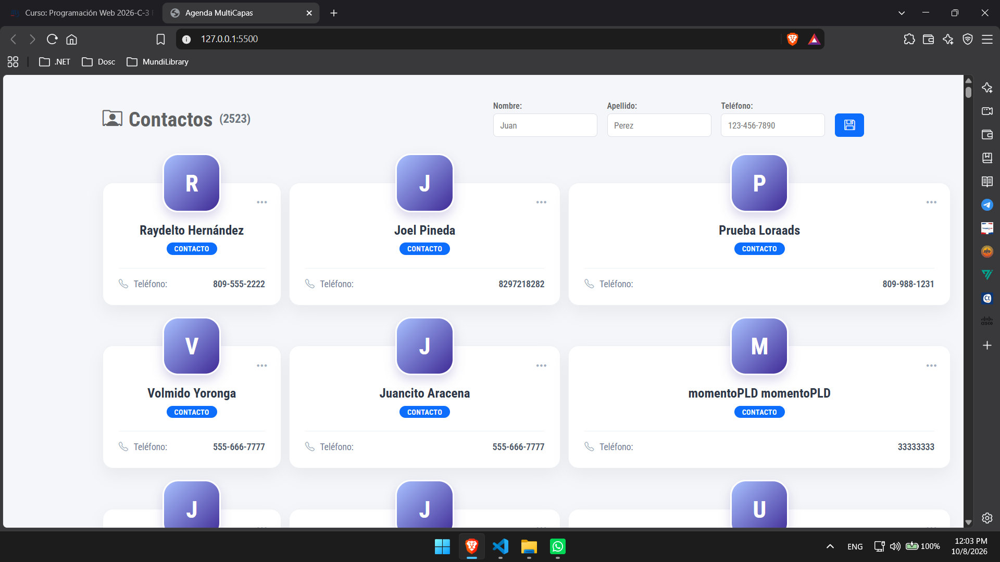
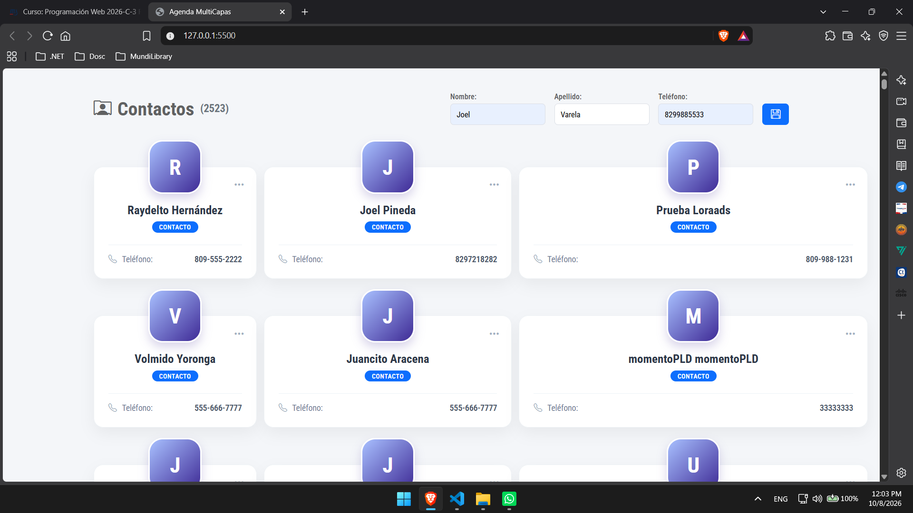
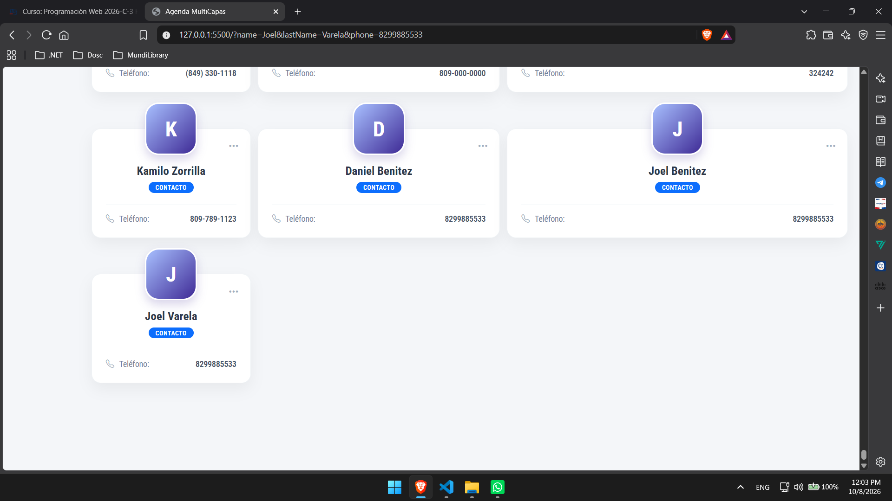

# AgendaMulticapas  -  Asignatura Programación web - Profesor Raydelto Hernández

Esta es una agenda multi capas la cual busca realizar las siguientes tareas:
<ul>
  <li>Consulta mediante la función fetch de js a la url `http://www.raydelto.org/agenda.php`
  con el fin de obtener mediante el **Method** `GET` el listado de los diversos contactos registrados en dicha **url.** </li>
  <li>Registro de nuevos contactos mediante el uso de la url `http://www.raydelto.org/agenda.php` se debe utilizar 
    el **Method** `POST` para registrar nuevos contactos en la agenda multi capas.</li>
</ul>

Dicho sistema corresponde a la asignación #3 de la asignatura de **Programación web** del  **Instituto Tecnológico de las Américas ITLA** bajo el cargo del docente  **Raydelto Hernández**. 
Autor: `Joel Alberto Benitez Varela | 2025-1049`.

### Capturas de pantalla

Consulta de los registros: 

Nuevo registro:

